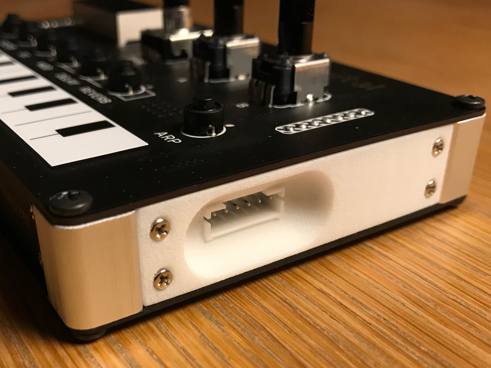

# Side Panel with Dubug Port for NTS-1

NTS-1のSWD用ポートにアクセスするための穴があるサイドパネルです。

# Photo

# Features

NTS-1のメインボードにJST PHコネクタを追加しておくと、このサイドパネルの穴からアクセスできるようになります。
JST PHに適合するケーブルの他、2mmピッチのQIメスコネクタに対応するパネルもあります。
おまけ機能として、メインボードをガッチリホールドして全体の剛性を向上させ、前後のプラグの抜き差しを助けます。

# Requirement

NTS-1のメインボードにJST PH 6ピンのライトアングルコネクタがはんだ付けされている必要があります。

# Installation

通常のサイドパネルを使うときとは組み立て手順が異なります。
ちょっとだけ考えてから組み立てれば大丈夫だと思います。
穴のないパネルが左側、穴のあるパネルが右側用になります。

# Usage

3Dプリンタで出力するのがお勧めです。
私はDMM.makeのサービスからナイロンで出力したものを使っています。

# Note

可用性、安全性、その他いかなる性質も保証しません。
いかなる用法も、またのその結果も保証しません。

# Author

* @tokuhira (twitter)
* github.com/tokuhira

# License

BSD 3-Clause License

Copyright (c) 2020, tokuhira.net
All rights reserved.